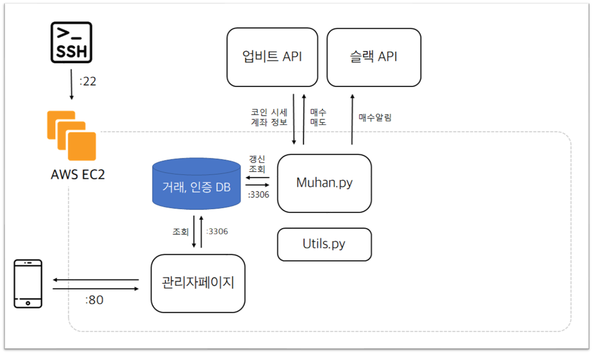
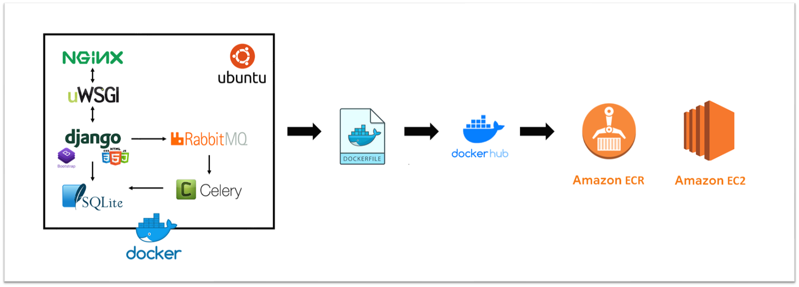
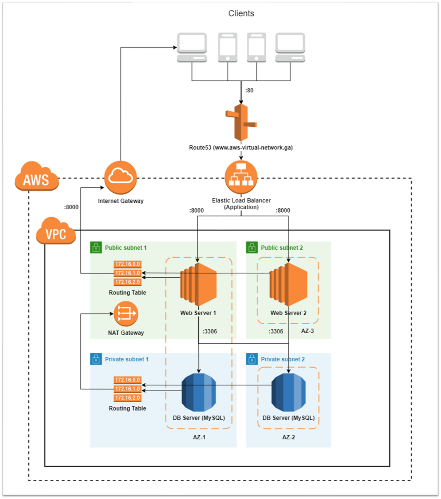
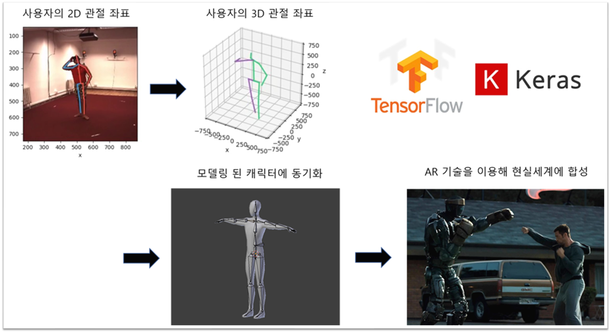

# [Portfolio](https://casselkim.notion.site/R-sum-afbddde0333a4d1498cd3fae7eab293f)

## Contact

**Email**. seongr39@gmail.com

## Channel

**Github**. [https://github.com/CasselKim](https://github.com/CasselKim)

**LinkedIn**. [https://www.linkedin.com/in/seongrok-kim-71767720a/](https://www.linkedin.com/in/seongrok-kim-71767720a/)

  　  

# Work experience

### (주)해달프로그래밍(2020.09.09 - 2021.03.08)

*서비스 기획, Project Management*

- 경영전략수립

- 쇼핑몰, 웹사이트 기획

  (제안서, PRD, UX디자인, 와이어프레임)

- 회사 브랜딩 (린 브랜딩)

- 데이터베이스 설계

- 30명 규모 로컬 이벤트 개최(온라인)

- 다양한 정부지원사업 준비 및 IR 자료 제작

- 콘텐츠 제작 (소프트웨어 컨텐츠, 캐릭터, 유통 등)

  　  

# Skills

## 💻 Technology

### AWS

EC2, S3를 이용하여 서비스를 개발, 배포해본적이 있으며 AWS ECR을 이용해 도커와 연동해본 경험이 있습니다. 또한 AWS의 인프라 스트럭쳐가 어떻게 구성되어 있고 어떤 api를 써서 통신하는지 공부한 적이 있습니다.

### Docker

로컬 개발환경(VScode) - 도커허브 - AWS ECR으로 이어지는 개발을 진행해본 적이 있습니다. 도커 이미지와 컨테이너에 대한 개념을 숙지하고 있으며 도커의 장단점을 이해하고 있습니다.

### GCP

콘솔을 사용하여 웹 서버를 배포해본적 있으며, GCP 서비스에 대해 간단하게 공부한 적이 있습니다

### Webcrawling, Automation

파이썬의 크롤링 프레임워크와 인공지능을 이용해 반복적인 업무를 자동화한 적이 있습니다.

### Artificial Intelligence

데이터와 tensorflow, pytorch, scikit-learn, pandas 등을 이용해 인공지능 모델을 개발하고 학습, 결과를 시각화한 적이 있습니다.

### Web Framework

장고 프레임워크와 HTML, CSS, JS 그리고 Bootstrap과 SQLite, NGinx을 이용해 간단한 웹서비스를 제작한 적이 있습니다.

# Project

## 비트코인 자동 매매기

비트코인 알고리즘 자동 매매

- Python으로 업비트 API를 사용해 조건에 따른 자동 매수/매도 프로그램을 제작했습니다.
- 잦은 외부 API 호출을 줄이고 로그를 수집하기 위해 데이터베이스(MySQL) 사용, Django로 관리자 페이지를 제작해 계좌 상황과 매수/매도 상황을 손쉽게 확인할 수 있게 했습니다.
- 프로세스는 크게 3개로 나뉩니다. ( every day 프로세스 / every second 프로세스 / 웹 서버 )
  - 각 프로세스에서 DB 갱신, 조건에 따른 매도/매수 진행을 진행합니다.
- 가장 어려웠던 점은 테이블의 잦은 수정입니다. 처음에 ERD Cloud를 그리는데 많은 시간을 할애했음에도 불구하고 서비스를 개발해감에 따라 필드값이 수정되고 새로운 테이블이 생성되는 등 많은 변동사항이 생겼습니다. 이는 다음과 같은 문제를 야기했습니다.
  - 클라이언트와 DB를 참조하는 프로세스들의 잦은 수정 → 발견 못한 오류들이 계속 발생
  - 개발속도의 지연 → 자료구조를수정해서 같은 기능을 구현하는데까지 오래걸림
    - 원래 파라미터로 받던 것들을 object의 attributes로 만들어 넘기는 형식으로 바꿈
  - **데이터베이스의 구조대로 서비스를 변경 → 서비스의 본질(소비자 친화적)에서 멀어짐**
    - 원래 기획은 수익금과 수익률까지 제공해야 하는데, 테이블에는 수익금 필드만 있어서 수익률을 계산하려면 클라이언트에서 가공해야함
    - 그런데 클라이언트에서 가공하기에는 비용이 많이 들어서 수익률을 서비스에서 제외함
    - 너무 기획의도와 멀어져서 테이블에 수익률 필드를 추가, row를 다시 생성함.
- 이 프로젝트를 통해서 처음에 서비스 정의서와 기술요구사항 등을 얼마나 제대로 작성하냐에 따라 개발 속도와 코드의 품질, 서비스의 일관성이 좌우된다는 것을 깨달았습니다. 단지 기획자, PM이 작성한 대로 만드는 것이 아닌 개발자 자신이 주도적으로 참여해 높아진 서비스 이해도를 바탕으로 개발을 진행해야 한다고 느꼈습니다.
- 링크 : [https://github.com/CasselKim/muhan_maesuV2](https://github.com/CasselKim/muhan_maesuV2)

## HOXY.kr

유명인들의 롤 닉네임을 추적

- 도커 컨테이너 밑에서 Django와 Nginx, Celery로 웹 서버를 구성했습니다.
- 컨테이너는 docker Image로 빌드 후 dockerhub - AWS ECR으로 EC2위에 배포했습니다.
- 이를 통해 도커를 이용한 웹 서비스의 빌드 및 배포과정을 이해했습니다.
  - 저는 윈도우 개발환경에서 작업하기 때문에 우분투 환경인 EC2에 배포할 때는 항상 많은 오류들에 부딪혔습니다. 그런데 처음부터 도커의 컨테이너에서 우분투 환경을 만들어놓고 그 위에서 개발한 내용을 그대로 이미지로 빌드해서 ECR로 옮기면 EC2 환경에서 아무런 오류없이 그대로 실행되는 것이 너무 편했습니다.
  - 도커의 장점은 개념적으로 컨테이너를 쉽게 나눌 수 있고 컨테이너 위에 올라가는 개발 환경들은 이미지에 그대로 빌드되어 어디서든 똑같은 환경에서 개발을 진행할 수 있다는 것입니다. 도커허브에서 버전 관리까지 되고, 컨테이너 관리 시스템인 쿠버네티스를 이용한다면 개발이 운영까지 이어지는 Devops까지 구현할 수 있으니 정말 잘 만든 서비스라고 생각됩니다.
- 또한 기능정의, 스토리보드 작성, DB 및 아키텍쳐 설계, 디자인/개발까지 해보면서 각 역할들에 대한 이해와 사전 준비를 철저하게 진행해야 개발이 잘 진행된다는 것을 깨달았습니다.

링크 : [https://github.com/CasselKim/hoxy.kr](https://github.com/CasselKim/hoxy.kr)

## AWS Virtual Network

LAN을 AWS에서 구현해보기

- 후니의 쉽게 쓴 Cisco 네트워킹 책을 보고 LAN을 구현해보려고 했는데 한계가 있어서 AWS에서 구현해본 내용입니다.
- 원래는 PC-스위치-라우터-인터넷 까지 연결하는 구조를 만들려고 했는데 물리적 네트워크에서 지향하는 구조와 AWS에서 지향하는 구조가 달라서 AWS VPC를 구축하는 프로젝트가 되어버렸습니다.
  - 물리적 네트워크는 각 장비들이 하는 역할이 제한되어 있고 명확한데, AWS(클라우드) 네트워크는 이를 논리적인 개념으로 나눠놓아서 계층을 넘나드는게 특징인 것 같습니다.
  - 예를 들어, 라우터 대신 라우터 테이블을 사용해 서버가 라우터 하위에 있다는 개념 보다는오브젝트 혹은 API처럼 사용해서 언제는 붙였다 뗄 수 있다는 점이 유용했습니다. 그리고 인스턴스와 데이터베이스를 여러 Zone에 나누고 다른 subnet으로 나누지만 같은 라우팅 테이블을 공유해 마치 하나처럼 사용한다는 점이 신기했습니다.
- 로드밸런싱까지 구현해보는 과정에서 어떤 value(cpu utilization 등)를 기준으로 트래픽을 분산하는지 배웠습니다. 운영의 관점에서 실시간 모니터링 및 로드 분산 기능이 얼마나 효과적인지 느낄 수 있었습니다.

## Unreal Steel

보조장치 없이 카메라만으로 구현하는 3D 모션캡쳐

- 카메라로 들어오는 사용자의 포즈를 파이썬(OpenCV) - 파이썬(Tensorflow) - Maya - Unreal Engine으로 가공, 실시간 데이터 스트리밍을 통해 전달하는 서비스입니다. 각 프로그램 간 통신은 UDP 소켓통신으로 진행했습니다.
- 인공지능으로 모션 인식 → 3D좌표로 복원 후 리깅 작업 → 게임 엔진으로 렌더링 해 가상세계에서 캐릭터가 사용자의 포즈를 따라하게 합니다.
- 각종 인공지능 논문들을 바탕으로 3D 좌표로 복원까지는 완료했지만 3D 캐릭터에 좌표들을 remapping하는 과정에서 도메인 지식(3D camera coordinate, 3D character rigging)이 부족해서 개발을 중단하게 되었습니다. 프로그램 종속성이 너무 강해(unreal engine) 디버깅하기가 너무 어려웠고, 새로운 프로그램을 개발하기엔 너무 난이도가 높다고 판단했습니다.
- 서비스를 구현하는데 도메인 지식이 굉장히 중요하다는 것을 깨달았습니다. 무작정 구현만 하면 되겠지라고 생각했는데, 도메인 관련 지식이 하나도 없으니 개발이 하나도 진행되지 않고 도메인 관련 정보만 수집하게 되었습니다. 다음부터 생소한 분야 개발을 하게 된다면 사전 조사 혹은 관련 전문가에게 꼭 조언을 구하고 진행해야 겠다고 생각했습니다.
- 그리고 커뮤니티의 힘이 굉장히 중요하다는 것도 깨달았습니다. 언리얼 엔진의 개발 커뮤니티는 굉장히 규모가 작았고 AutoDesk 사의 MAYA 프로그램은 커뮤니티 자체가 없었습니다. 차라리 조금 더 커뮤니티 규모가 큰 기술 스택을 사용했다면 수월하게 개발할 수 있지 않았을까 라는 생각이 들었습니다.

링크 : [https://github.com/HP-DEVGRU/UnrealSteel](https://github.com/HP-DEVGRU/UnrealSteel)

## 스팀 리뷰 크롤링

스팀 리뷰들을 웹 크롤링

- bs4, selenium, 스팀api로 게임 리뷰 데이터셋 34만건 수집
- 비정상적인 데이터, 결측값 예외처리 과정에서 예외처리에 대한 중요성을 이해했습니다.
    - 스팀API가 완전하게 정제되어 있지 않았습니다(100개중에 1개꼴로 이상한 값). 그래서 일단 수집한 다음 클라이언트와 상의하여 대체할 수 있는 결측치는 대체하고 (ex:award 숫자) critical한 값들은 record를 제거하여 Data cleaning을 진행하였습니다.
    - 스팀 프로필은 공개수준을 유저가 정할 수 있어서 if문으로는 모두 정의할 수 없는 케이스들이 있었습니다. 그래서 수집과정에서 에러가 발생하지 않도록 if문과 try문으로 제어하고 Data exploration으로 데이터의 이상유무를 확인했습니다.
- 데이터 수집 전 클라이언트의 요구사항정의는 디테일해야만 한다는 것을 경험했습니다.
    - 경북대학교 경상대학 연구실의 의뢰로 데이터를 수집했는데, 저도 연구생도 데이터 수집에 대해 경험이 별로 없어서 제대로 된 문서도 없이 무작정 진행했습니다. 그러자 서로의 의도와 다른 결과가 나타났고, 뒤늦게 데이터 정의서를 작성했지만 계속 수정되었고 그 횟수만큼 처음부터 수집해야해서 기간이 너무 오래걸렸습니다.
    - 스팀 게임 리뷰의 도메인 지식 또한 없는 상태로 프로젝트를 시작하여 결과로 나온 값이 무엇을 뜻하는지, 범위가 정상인지 확인할 수 없었습니다. 프로젝트 중간부터 스팀 게임 리뷰 시스템에 대해 공식문서를 찾아보고 검색을 해보면서 필요한 데이터 목록과 범위를 정리할 수 있었습니다.    
- 데이터 수집 개수가 많은 만큼 데이터 수집 및 처리 알고리즘에 대한 필요성을 체감했습니다.    
    - 데이터를 수집하는 방법 3가지(API, bs4, selenium)    
        - API가 가장 빠르지만 가끔씩 출력오류가 발생  
        - BeautifulSoup4는 다음으로 빠르지만 동적 스크립트는 읽지 못함  
        - Selenium은 가장 느리지만 모든 동작 가능  
    - API로 리뷰 데이터를 받고 결측치 제거 (리뷰가 많아서 제거하기로함)  
    - Selenium은 최소한의 job을 수행하도록 미리 작업을 진행했습니다.  
    Ex) page를 넘기는 동작 : 다음 버튼 누르기 → ?page=2 url 요청  

링크 : [https://www.notion.so/casselkim/Steam-Crawling-a5665c4dc8f64e87a0aee259d2c2dbc9](https://www.notion.so/Steam-Crawling-a5665c4dc8f64e87a0aee259d2c2dbc9)

# GDG Daegu Organizer

GDG Daegu Chapter를 만든 organizer로서 로컬 개발자들을 위한 여러 행사들을 개최하였습니다.

[GDG Daegu | Google Developer Groups](https://gdg.community.dev/gdg-daegu/)

# Activities

학부생동안 수많은 해커톤과 대외활동을 했습니다. 자세한 내용은 아래 링크에 있습니다.

[https://github.com/CasselKim/sw2020/blob/main/Summary.md](https://github.com/CasselKim/sw2020/blob/main/Summary.md)
